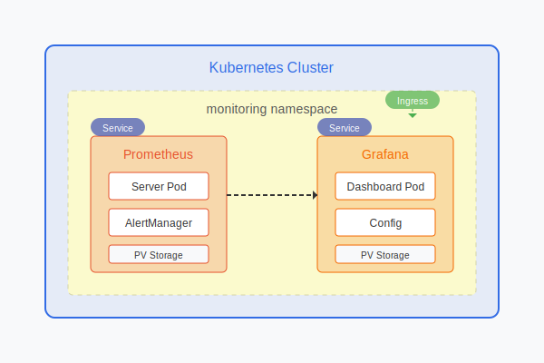

# terraform 
# Secure Multi-Service Web Application with Infrastructure as Code

A comprehensive web application deployment solution that combines a Java-based user management system with containerized microservices, secure infrastructure provisioning, and Kubernetes orchestration.

This project provides an enterprise-grade application architecture that includes user authentication, caching, message queuing, and search functionality. The infrastructure is defined as code using Terraform, with both basic and secure VPC configurations available. The application is containerized using Docker and can be deployed using either Docker Compose or Kubernetes.

The solution implements several key architectural patterns:
- Multi-tier application architecture with separate frontend, backend, and data layers
- Microservices communication using RabbitMQ for message queuing
- MySQL for database
- Distributed caching with Memcached
- Full-text search capabilities using Elasticsearch
- Security-first infrastructure design with public/private subnets and bastion hosts

## Repository Structure
```
.
├── app/                          # Main application code and configuration
│   ├── src/                     # Java source code
│   │   ├── main/               
│   │   │   ├── java/           # Application Java classes
│   │   │   ├── resources/      # Application properties and SQL scripts
│   │   │   └── webapp/         # Web resources and Spring configurations
│   │   └── test/               # Test cases
│   ├── Dockerfile              # Application container definition
│   └── pom.xml                 # Maven project configuration
├── db/                          # Database setup and configuration
│   ├── Dockerfile              # MySQL container definition
│   └── db_backup.sql           # Database initialization script
├── docker-compose.yml          # Multi-container Docker composition
├── Kubernetes/                 # Kubernetes deployment configurations
│   ├── app-deployment/         # Application deployment manifests
│   ├── db-deployment/          # Database deployment manifests
│   ├── memcached/             # Cache service deployment
│   └── rabbitmq/              # Message queue deployment
└── vpc_secure/                # Secure AWS infrastructure as code
    ├── main.tf                # Main Terraform configuration
    └── variables.tf           # Infrastructure variables
```

## Usage Instructions
### Prerequisites
- Java Development Kit (JDK) 17
- Maven 3.9.6 or higher
- Docker and Docker Compose
- Kubernetes cluster (for K8s deployment)
- AWS CLI (for infrastructure deployment)
- Terraform 0.12 or higher

### Installation

1. Clone the repository:
```bash
git clone <repository-url>
cd <repository-name>
```

2. Build the application:
```bash
cd app
mvn clean package
```

3. Build and run with Docker Compose:
```bash
docker-compose build
docker-compose up -d
```

### Quick Start
1. Deploy the infrastructure (if using AWS):
```bash
cd vpc_secure
terraform init
terraform plan
terraform apply
```

2. Deploy to Kubernetes:
```bash
kubectl apply -f Kubernetes/db-deployment/
kubectl apply -f Kubernetes/memcached/
kubectl apply -f Kubernetes/rabbitmq/
kubectl apply -f Kubernetes/app-deployment/
```

### More Detailed Examples

1. User Management API:
```java
// Create a new user
POST /api/users
{
    "username": "testuser",
    "password": "password123",
    "email": "test@example.com"
}

// Authenticate user
POST /api/login
{
    "username": "testuser",
    "password": "password123"
}
```

2. File Upload:
```java
// Upload user profile image
POST /uploadFile
Content-Type: multipart/form-data
file: <binary-data>
```

### Troubleshooting

1. Application Connectivity Issues:
- Check service status: `docker-compose ps`
- View logs: `docker-compose logs -f vproapp`
- Verify database connection: `mysql -h localhost -P 3306 -u root -p accounts`

2. Infrastructure Issues:
- Verify VPC configuration: `terraform show`
- Check security group rules
- Validate NAT Gateway status

## Data Flow
The application implements a multi-tier architecture with distributed services.

```ascii
[Client] → [Nginx Ingress] → [Spring MVC App] → [Services Layer]
                                    ↓
[RabbitMQ] ← [Message Service] ← [Business Logic] → [Memcached]
                                    ↓
                            [MySQL Database]
```

Key component interactions:
1. Client requests are load balanced through Nginx Ingress
2. Authentication requests are handled by Spring Security
3. User data is cached in Memcached for performance
4. Asynchronous operations use RabbitMQ queues
5. Database operations are performed through JPA/Hibernate
6. File uploads are processed and stored separately
7. Search operations utilize Elasticsearch

## Infrastructure



### VPC Resources
- VPC: Custom VPC with DNS support
- Subnets: Public and private subnets in us-east-1a
- Gateways: Internet Gateway and NAT Gateway
- Route Tables: Separate tables for public and private subnets

### Security
- Security Groups: SSH access control
- Bastion Host: Public subnet access point
- Private EC2: Protected instance in private subnet

### Networking
- Elastic IP: For NAT Gateway
- Route Tables: Configured for public and private subnet routing
- Network ACLs: Default network access control