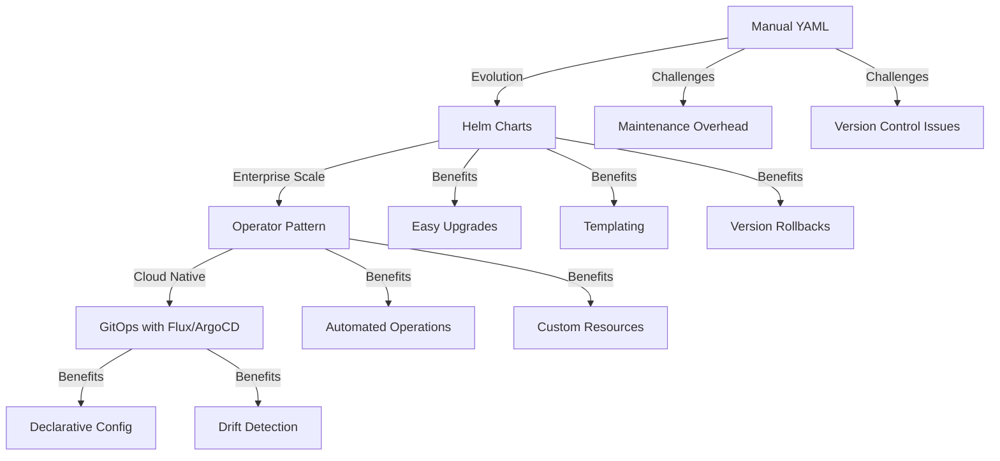
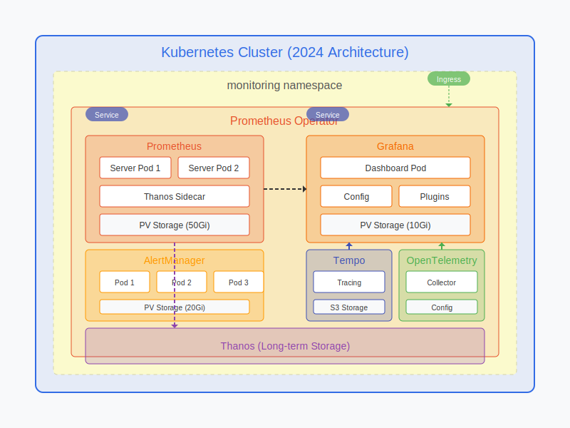
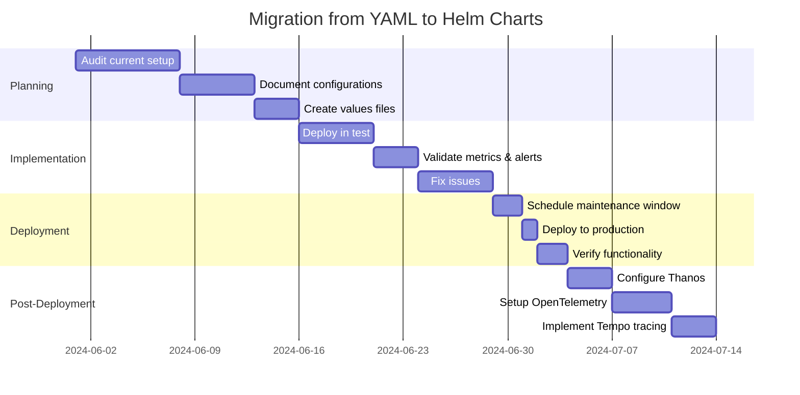

# 📊 Prometheus and Grafana Implementation Approaches (2024)


## 📢 Latest Updates (2024)


> **Note:** These updates represent the latest best practices for enterprise monitoring

- **Prometheus 2.48.0** introduces enhanced remote write capabilities and improved performance
- **Grafana 10.3.x** adds advanced dashboard linking and variable enhancements
- **Thanos** integration for long-term storage and high availability is now standard
- **Cortex/Mimir** adoption for multi-tenancy and horizontal scaling
- **OpenTelemetry** integration for unified observability framework
- **Grafana Tempo** for distributed tracing complements metrics and logs
- **Grafana Loki 3.x** with improved query performance and index storage
- **Grafana OnCall** integration for advanced alerting workflows


## 🏭 Production-Grade Implementation Options

The YAML files in this project (like the Grafana service definition) represent a manual Kubernetes deployment approach. In production environments, there are several approaches with different trade-offs:

### 1. Manual YAML files (current approach) 📄
- ✅ Provides full control over every configuration aspect
- ✅ Good for learning and understanding each component
- ❌ More difficult to maintain at scale
- ❌ Requires manual updates for new versions

### 2. Helm charts (production recommended) ⎈
- ✅ Industry standard for production deployments
- ✅ Easier version management and upgrades
- ✅ Built-in best practices and configurations
- ✅ Simpler templating for multi-environment deployments
- ❌ Slightly less granular control than manual YAML

### 3. Operator pattern 🤖
- ✅ The Prometheus Operator provides even more sophisticated management
- ✅ Handles high availability, scaling, and upgrades automatically
- ✅ Custom resources for ServiceMonitors, AlertmanagerConfig, etc.
- ✅ Best for large-scale enterprise deployments
- ❌ More complex initial setup

## 🔥 Why Helm is Preferred in Production




Helm would be the recommended approach for production because:

1. 💾 **Simplified management** - Package all related resources together
2. 🔙 **Versioning** - Easy rollbacks and upgrades
3. 📝 **Configuration** - Values files for different environments
4. 👥 **Community maintenance** - Regular security and feature updates
5. 🔧 **Consistency** - Standardized deployment patterns

## 👷 Implementing with Helm

<p align="center">
  
  
</p>

> ⚡ **Latest Implementation (2024)**
>
> Here's how you could implement the same monitoring stack with Helm using the latest best practices:

```bash
# Add Prometheus community charts repo
helm repo add prometheus-community https://prometheus-community.github.io/helm-charts
helm repo add grafana https://grafana.github.io/helm-charts
helm repo update

# Create a dedicated namespace with resource quotas
kubectl create namespace monitoring
kubectl apply -f - <<EOF
apiVersion: v1
kind: ResourceQuota
metadata:
  name: monitoring-quota
  namespace: monitoring
spec:
  hard:
    requests.cpu: "4"
    requests.memory: 8Gi
    limits.cpu: "8"
    limits.memory: 16Gi
EOF

# Install Prometheus with high availability configuration and Thanos integration
helm install prometheus prometheus-community/kube-prometheus-stack \
  --namespace monitoring \
  --set prometheus.prometheusSpec.retention=30d \
  --set prometheus.prometheusSpec.replicas=2 \
  --set prometheus.prometheusSpec.storageSpec.volumeClaimTemplate.spec.resources.requests.storage=50Gi \
  --set prometheus.prometheusSpec.storageSpec.volumeClaimTemplate.spec.storageClassName=premium-ssd \
  --set prometheus.prometheusSpec.resources.limits.cpu=2000m \
  --set prometheus.prometheusSpec.resources.limits.memory=4Gi \
  --set prometheus.prometheusSpec.resources.requests.cpu=1000m \
  --set prometheus.prometheusSpec.resources.requests.memory=2Gi \
  --set prometheus.prometheusSpec.thanos.objectStorageConfig.name=thanos-objstore-config \
  --set prometheus.prometheusSpec.thanos.image=quay.io/thanos/thanos:v0.32.2 \
  --set alertmanager.alertmanagerSpec.replicas=3 \
  --set grafana.enabled=true \
  --set grafana.persistence.enabled=true \
  --set grafana.persistence.size=10Gi \
  --set grafana.serviceMonitor.enabled=true \
  --set grafana.sidecar.dashboards.enabled=true \
  --set grafana.sidecar.datasources.enabled=true

# Install Grafana Tempo for distributed tracing
helm install tempo grafana/tempo \
  --namespace monitoring \
  --set tempo.storage.trace.backend=s3 \
  --set tempo.storage.trace.s3.bucket=tempo-traces \
  --set tempo.storage.trace.s3.endpoint=s3.amazonaws.com \
  --set tempo.receivers.jaeger.protocols.grpc.endpoint=0.0.0.0:14250 \
  --set tempo.receivers.jaeger.protocols.thrift_http.endpoint=0.0.0.0:14268

# Install OpenTelemetry Collector
helm install opentelemetry-collector open-telemetry/opentelemetry-collector \
  --namespace monitoring \
  --set mode=deployment \
  --set config.exporters.otlp.endpoint=tempo.monitoring.svc.cluster.local:4317 \
  --set config.service.pipelines.traces.exporters[0]=otlp
```
💡 **Pro Tip**: For production environments, always set resource requests and limits to prevent resource contention and ensure predictable performance.

## 💻 Customizing Helm Deployments (2024)


### 📚 Basic Configuration


For more advanced configurations, you can create a custom values file:

```yaml
# prometheus-values.yaml
server:
  persistentVolume:
    size: 10Gi
  retention: 15d
  
alertmanager:
  enabled: true
  
# Additional configuration...
```

Then install using:

```bash
helm install prometheus prometheus-community/prometheus \
  --namespace monitoring \
  --values prometheus-values.yaml
```

### 💯 Advanced Configuration (2024)

```yaml
# kube-prometheus-stack-values.yaml
prometheus:
  prometheusSpec:
    retention: 45d
    replicas: 3
    podMonitorSelectorNilUsesHelmValues: false
    serviceMonitorSelectorNilUsesHelmValues: false
    storageSpec:
      volumeClaimTemplate:
        spec:
          storageClassName: "ssd-premium"
          resources:
            requests:
              storage: 100Gi
    resources:
      limits:
        cpu: 4000m
        memory: 8Gi
      requests:
        cpu: 1000m
        memory: 4Gi
    thanos:
      baseImage: quay.io/thanos/thanos
      version: v0.32.2
      objectStorageConfig:
        key: thanos.yaml
        name: thanos-objstore-secret
        
alertmanager:
  alertmanagerSpec:
    replicas: 3
    retention: 120h
    storage:
      volumeClaimTemplate:
        spec:
          storageClassName: "standard"
          resources:
            requests:
              storage: 20Gi
    alertmanagerConfiguration:
      name: main-rules
    externalUrl: https://alertmanager.example.com

grafana:
  enabled: true
  ingress:
    enabled: true
    ingressClassName: nginx
    hosts:
      - grafana.example.com
    tls:
      - secretName: grafana-tls
        hosts:
          - grafana.example.com
  persistence:
    enabled: true
    size: 10Gi
  plugins:
    - grafana-piechart-panel
    - grafana-worldmap-panel
    - grafana-clock-panel
  dashboardProviders:
    dashboardproviders.yaml:
      apiVersion: 1
      providers:
        - name: 'default'
          orgId: 1
          folder: ''
          type: file
          disableDeletion: false
          editable: true
          options:
            path: /var/lib/grafana/dashboards/default
```

## 🚀 Migration Strategy

### 💯 Comparison of Approaches


| Feature | Manual YAML | Helm Charts | Operator Pattern | GitOps (ArgoCD/Flux) |
|---------|------------|-------------|------------------|----------------------|
| Setup Complexity | ⭐ | ⭐⭐ | ⭐⭐⭐ | ⭐⭐⭐ |
| Maintenance Effort | ⭐⭐⭐ | ⭐⭐ | ⭐ | ⭐ |
| Scalability | ⭐ | ⭐⭐ | ⭐⭐⭐ | ⭐⭐⭐ |
| Upgrade Ease | ⭐ | ⭐⭐⭐ | ⭐⭐⭐ | ⭐⭐⭐⭐ |
| Configuration Flexibility | ⭐⭐⭐ | ⭐⭐ | ⭐⭐ | ⭐⭐⭐ |
| Enterprise Readiness | ⭐ | ⭐⭐ | ⭐⭐⭐ | ⭐⭐⭐⭐ |
| Multi-cluster Support | ⭐ | ⭐⭐ | ⭐⭐⭐ | ⭐⭐⭐⭐ |
| GitOps Integration | ⭐ | ⭐⭐⭐ | ⭐⭐⭐ | ⭐⭐⭐⭐ |
| Drift Detection | ⭐ | ⭐ | ⭐⭐ | ⭐⭐⭐⭐ |
| Audit Trail | ⭐ | ⭐⭐ | ⭐⭐ | ⭐⭐⭐⭐ |



*Figure: Modern Prometheus and Grafana deployment architecture in Kubernetes (2024)*

### 📊 Step-by-Step Migration Plan




### 📝 Detailed Migration Steps


1. 💾 **Export current configurations and settings**
   - Document all current Prometheus targets
   - Export all Grafana dashboards as JSON
   - Document all alerting rules
   - Back up Prometheus rules and alerts

2. 📝 **Create appropriate values files for Helm**
   - Map current configurations to Helm values
   - Include resource requirements
   - Configure persistence and high availability
   - Set up Thanos for long-term storage

3. 🚧 **Deploy using Helm in a test environment**
   - Set up a staging namespace
   - Deploy with the same resource allocations
   - Import existing dashboards
   - Test with sample application metrics

4. 🔍 **Validate functionality and monitoring data**
   - Compare metrics between old and new systems
   - Test alerting functionality
   - Verify dashboard operations
   - Run load tests to ensure performance

5. 📅 **Schedule production migration with minimal downtime**
   - Use a blue/green deployment strategy
   - Maintain both systems briefly in parallel
   - Switch traffic once verified
   - Implement automated backup procedures

> ❗ **Important**: Always back up all configurations, dashboards, and rules before migration!

## 📋 Implementation Checklist


- [x] Create namespace with resource quotas
- [x] Deploy Prometheus with HA configuration
- [x] Deploy Grafana with persistent storage
- [x] Configure application metrics scraping
- [x] Set up dashboards for application metrics
- [x] Set up dashboards for Kubernetes metrics
- [x] Configure alerting rules
- [x] Set up notification channels
- [x] Implement backup strategy for configurations
- [x] Document access and management procedures
- [x] Configure Thanos for long-term storage
- [x] Set up OpenTelemetry collectors
- [x] Implement Tempo for distributed tracing
- [x] Configure Loki for log aggregation
- [x] Implement GitOps workflow with ArgoCD/Flux

## 🔄 Ongoing Maintenance


### Regular Tasks

1. **Weekly**
   - Review alert history
   - Check resource usage of monitoring components
   - Verify backup completion
   - Monitor Thanos compaction jobs
   - Review OpenTelemetry collector health

2. **Monthly**
   - Review dashboard relevance
   - Update Grafana plugins
   - Check for Helm chart updates
   - Rotate service accounts and credentials
   - Test disaster recovery procedures

3. **Quarterly**
   - Major version upgrades
   - Review retention policies
   - Audit access controls
   - Performance optimization
   - Capacity planning review


## 📚 Additional Resources & References


- [Prometheus Helm Chart Documentation](https://github.com/prometheus-community/helm-charts/tree/main/charts/prometheus)
- [Grafana Helm Chart Documentation](https://github.com/grafana/helm-charts/tree/main/charts/grafana)
- [Prometheus Operator Documentation](https://prometheus-operator.dev/)
- [Grafana Dashboard Examples](https://grafana.com/grafana/dashboards/)
- [Prometheus Query Language Documentation](https://prometheus.io/docs/prometheus/latest/querying/basics/)
- [Thanos Documentation](https://thanos.io/tip/thanos/getting-started.md/)
- [OpenTelemetry Documentation](https://opentelemetry.io/docs/)
- [Grafana Tempo Documentation](https://grafana.com/docs/tempo/latest/)
- [Grafana Loki Documentation](https://grafana.com/docs/loki/latest/)
- [ArgoCD for GitOps](https://argo-cd.readthedocs.io/en/stable/)