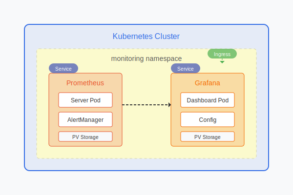

# 📊 Prometheus and Grafana Implementation Approaches


## 📢 Latest Updates (2023)

- **Prometheus 2.45.0** introduces improved performance with new storage engine
- **Grafana 10.x** now supports real-time streaming dashboards
- **AlertManager** enhanced with better silencing and grouping capabilities
- **ServiceMonitor CRDs** are now the preferred way to configure scraping
- **Grafana Loki** integration for log aggregation is now standard practice

</div>

## 🏭 Production-Grade Implementation Options

The YAML files in this project (like the Grafana service definition) represent a manual Kubernetes deployment approach. In production environments, there are several approaches with different trade-offs:

### 1. Manual YAML files (current approach) 📄
- ✅ Provides full control over every configuration aspect
- ✅ Good for learning and understanding each component
- ❌ More difficult to maintain at scale
- ❌ Requires manual updates for new versions

### 2. Helm charts (production recommended) ⎈
- ✅ Industry standard for production deployments
- ✅ Easier version management and upgrades
- ✅ Built-in best practices and configurations
- ✅ Simpler templating for multi-environment deployments
- ❌ Slightly less granular control than manual YAML

### 3. Operator pattern 🤖
- ✅ The Prometheus Operator provides even more sophisticated management
- ✅ Handles high availability, scaling, and upgrades automatically
- ✅ Custom resources for ServiceMonitors, AlertmanagerConfig, etc.
- ✅ Best for large-scale enterprise deployments
- ❌ More complex initial setup

## 🔥 Why Helm is Preferred in Production


Helm would be the recommended approach for production because:

1. 💾 **Simplified management** - Package all related resources together
2. 🔙 **Versioning** - Easy rollbacks and upgrades
3. 📝 **Configuration** - Values files for different environments
4. 👥 **Community maintenance** - Regular security and feature updates
5. 🔧 **Consistency** - Standardized deployment patterns

## 👷 Implementing with Helm

<div style="background-color: #f8f9fa; padding: 15px; border-radius: 5px; border-left: 5px solid #28a745;">

### ⚡ Latest Implementation (2023)

Here's how you could implement the same monitoring stack with Helm using the latest best practices:

```bash
# Add Prometheus community charts repo
helm repo add prometheus-community https://prometheus-community.github.io/helm-charts
helm repo add grafana https://grafana.github.io/helm-charts
helm repo update

# Create a dedicated namespace with resource quotas
kubectl create namespace monitoring
kubectl apply -f - <<EOF
apiVersion: v1
kind: ResourceQuota
metadata:
  name: monitoring-quota
  namespace: monitoring
spec:
  hard:
    requests.cpu: "4"
    requests.memory: 8Gi
    limits.cpu: "8"
    limits.memory: 16Gi
EOF

# Install Prometheus with high availability configuration
helm install prometheus prometheus-community/prometheus \
  --namespace monitoring \
  --set server.persistentVolume.size=20Gi \
  --set server.retention=30d \
  --set server.replicaCount=2 \
  --set alertmanager.persistentVolume.enabled=true \
  --set alertmanager.persistentVolume.size=5Gi \
  --set alertmanager.replicaCount=2 \
  --set server.resources.limits.cpu="1000m" \
  --set server.resources.limits.memory="2Gi" \
  --set server.resources.requests.cpu="500m" \
  --set server.resources.requests.memory="1Gi"

# Install Grafana with SSO and persistent storage
helm install grafana grafana/grafana \
  --namespace monitoring \
  --set persistence.enabled=true \
  --set persistence.size=10Gi \
  --set service.type=ClusterIP \
  --set ingress.enabled=true \
  --set ingress.hosts[0]=grafana.example.com \
  --set ingress.tls[0].hosts[0]=grafana.example.com \
  --set ingress.tls[0].secretName=grafana-tls \
  --set "grafana.ini.auth.generic_oauth.enabled=true" \
  --set "grafana.ini.auth.generic_oauth.name=OAuth" \
  --set resources.limits.cpu="500m" \
  --set resources.limits.memory="1Gi" \
  --set resources.requests.cpu="200m" \
  --set resources.requests.memory="512Mi"
```
</div>

> 💡 **Pro Tip**: For production environments, always set resource requests and limits to prevent resource contention and ensure predictable performance.

## 💻 Customizing Helm Deployments

<table>
<tr>
<td width="50%">

### 📚 Basic Configuration

For more advanced configurations, you can create a custom values file:

```yaml
# prometheus-values.yaml
server:
  persistentVolume:
    size: 10Gi
  retention: 15d
  
alertmanager:
  enabled: true
  
# Additional configuration...
```

Then install using:

```bash
helm install prometheus prometheus-community/prometheus \
  --namespace monitoring \
  --values prometheus-values.yaml
```

</td>
<td width="50%">

### 💯 Advanced Configuration (2023)

```yaml
# prometheus-values-advanced.yaml
server:
  persistentVolume:
    size: 50Gi
    storageClass: "ssd-premium"
  retention: 45d
  replicaCount: 3
  podDisruptionBudget:
    enabled: true
    minAvailable: 1
  affinity:
    podAntiAffinity:
      requiredDuringSchedulingIgnoredDuringExecution:
        - topologyKey: "kubernetes.io/hostname"
  resources:
    limits:
      cpu: 2000m
      memory: 4Gi
    requests:
      cpu: 1000m
      memory: 2Gi
      
alertmanager:
  enabled: true
  replicaCount: 3
  config:
    route:
      group_by: ['alertname', 'job']
      group_wait: 30s
      group_interval: 5m
      repeat_interval: 12h
      receiver: 'pagerduty'
    receivers:
    - name: 'pagerduty'
      pagerduty_configs:
      - service_key: '<key>'
```

</td>
</tr>
</table>

## 🚀 Migration Strategy

### 💯 Comparison of Approaches

<table>
<tr>
<th>Feature</th>
<th>Manual YAML</th>
<th>Helm Charts</th>
<th>Operator Pattern</th>
</tr>
<tr>
<td>Setup Complexity</td>
<td>⭐</td>
<td>⭐⭐</td>
<td>⭐⭐⭐</td>
</tr>
<tr>
<td>Maintenance Effort</td>
<td>⭐⭐⭐</td>
<td>⭐⭐</td>
<td>⭐</td>
</tr>
<tr>
<td>Scalability</td>
<td>⭐</td>
<td>⭐⭐</td>
<td>⭐⭐⭐</td>
</tr>
<tr>
<td>Upgrade Ease</td>
<td>⭐</td>
<td>⭐⭐⭐</td>
<td>⭐⭐⭐</td>
</tr>
<tr>
<td>Configuration Flexibility</td>
<td>⭐⭐⭐</td>
<td>⭐⭐</td>
<td>⭐⭐</td>
</tr>
<tr>
<td>Enterprise Readiness</td>
<td>⭐</td>
<td>⭐⭐</td>
<td>⭐⭐⭐</td>
</tr>
</table>

<div style="display: flex; justify-content: center;">

</div>

<div style="text-align: center; font-style: italic; margin-bottom: 20px;">
Figure: Prometheus and Grafana deployment architecture in Kubernetes
</div>

### 📊 Step-by-Step Migration Plan


### 📝 Detailed Migration Steps

1. 💾 **Export current configurations and settings**
   - Document all current Prometheus targets
   - Export all Grafana dashboards as JSON
   - Document all alerting rules

2. 📝 **Create appropriate values files for Helm**
   - Map current configurations to Helm values
   - Include resource requirements
   - Configure persistence and high availability

3. 🚧 **Deploy using Helm in a test environment**
   - Set up a staging namespace
   - Deploy with the same resource allocations
   - Import existing dashboards

4. 🔍 **Validate functionality and monitoring data**
   - Compare metrics between old and new systems
   - Test alerting functionality
   - Verify dashboard operations

5. 📅 **Schedule production migration with minimal downtime**
   - Use a blue/green deployment strategy
   - Maintain both systems briefly in parallel
   - Switch traffic once verified

> ❗ **Important**: Always back up all configurations, dashboards, and rules before migration!